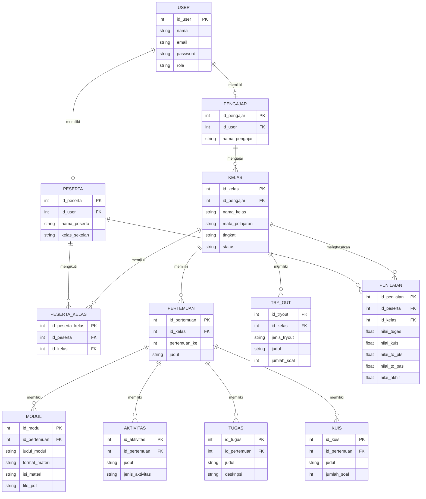

````markdown
# PERANCANGAN SISTEM

## DelLearn — Learning Management System Bimbingan Belajar SMP

---

## 1. Identitas Project

| Keterangan    | Detail                           |
| ------------- | -------------------------------- |
| Nama Aplikasi | DelLearn                         |
| Jenis Sistem  | Learning Management System (LMS) |
| Fokus Sistem  | Bimbingan Belajar Siswa SMP      |
| Mata Kuliah   | Pemrograman Web 2                |
| Konsep        | Admin Panel / Back-Office        |
| Arsitektur UI | Material Design                  |
| Platform      | Web                              |
| Implementasi  | Client-Side / Mock Data          |

---

## 2. Deskripsi Sistem

DelLearn merupakan Learning Management System berbasis web yang dirancang untuk
mendukung kegiatan pembelajaran pada bimbingan belajar tingkat SMP.

DelLearn menyediakan pembelajaran untuk lima mata pelajaran umum tingkat SMP,
yaitu:

1. Bahasa Inggris
2. Matematika
3. IPA
4. IPS
5. Bahasa Indonesia

Sistem digunakan oleh tiga jenis pengguna, yaitu Admin, Pengajar, dan Peserta.
Admin bertugas mengelola data dan aktivitas sistem, Pengajar mengelola kegiatan
pembelajaran pada kelas yang diampu, sedangkan Peserta mengikuti pembelajaran
dan mengerjakan aktivitas evaluasi.

Pembelajaran dalam DelLearn dibagi menjadi 12 pertemuan. Setiap pertemuan dapat
memiliki Pretest, Modul Pembelajaran, Aktivitas Interaktif, Latihan Soal, dan
Kuis.

Materi pembelajaran dapat dibuat langsung di dalam sistem menggunakan teks dan
gambar atau menggunakan file PDF. Pengajar dapat menggunakan salah satu format
atau menggabungkan beberapa format dalam satu kelas.

Selain pembelajaran rutin, DelLearn menyediakan Try Out PTS dan Try Out PAS
sebagai simulasi ujian sekolah.

---

## 3. Tujuan Sistem

Tujuan perancangan DelLearn adalah:

1. Menyediakan media pembelajaran berbasis web untuk siswa SMP.
2. Mendukung pembelajaran pada lima mata pelajaran umum tingkat SMP.
3. Memudahkan Pengajar dalam mengelola materi dan aktivitas pembelajaran.
4. Memudahkan Admin dalam mengelola data kelas, peserta, dan pengajar.
5. Menyediakan latihan dan evaluasi pembelajaran secara interaktif.
6. Menyediakan Try Out PTS dan PAS sebagai simulasi ujian sekolah.
7. Menyediakan rekap nilai untuk memantau hasil belajar peserta.

---

## 4. Mata Pelajaran

DelLearn menyediakan lima mata pelajaran utama:

| No. | Mata Pelajaran   |
| --- | ---------------- |
| 1   | Bahasa Inggris   |
| 2   | Matematika       |
| 3   | IPA              |
| 4   | IPS              |
| 5   | Bahasa Indonesia |

Mata pelajaran tersebut dapat digunakan untuk membuat beberapa kelas sesuai
tingkat atau kebutuhan peserta.

Contoh:

```text
Matematika SMP Kelas 8
Bahasa Inggris SMP Kelas 8
IPA SMP Kelas 8
IPS SMP Kelas 9
Bahasa Indonesia SMP Kelas 9
```
````

---

## 5. Role Pengguna

### 5.1 Admin

Admin memiliki hak akses untuk:

- Melihat dashboard sistem.
- Mengelola data kelas.
- Mengelola data peserta.
- Mengelola data pengajar.
- Mengelola pembelajaran.
- Mengelola modul.
- Mengelola tugas dan kuis.
- Mengelola Try Out PTS dan PAS.
- Melihat rekap nilai.

### 5.2 Pengajar

Pengajar memiliki hak akses untuk:

- Melihat kelas yang diampu.
- Melihat peserta dalam kelas.
- Mengelola modul pembelajaran.
- Menambahkan materi berupa teks, gambar, atau PDF.
- Membuat aktivitas interaktif.
- Membuat tugas.
- Membuat kuis.
- Melihat hasil pengerjaan peserta.
- Melihat rekap nilai kelas.

### 5.3 Peserta

Peserta memiliki hak akses untuk:

- Melihat kelas yang diikuti.
- Mengakses materi pembelajaran.
- Mengerjakan Pretest.
- Mengikuti Aktivitas Interaktif.
- Mengerjakan Latihan Soal.
- Mengerjakan Kuis.
- Mengikuti Try Out PTS dan PAS.
- Melihat hasil dan nilai pribadi.

---

## 6. Fitur Utama

### 6.1 Dashboard

Dashboard memberikan informasi ringkas mengenai kondisi sistem seperti:

- Jumlah kelas.
- Jumlah pengajar.
- Jumlah peserta.
- Daftar kelas aktif.
- Informasi Try Out mendatang.

### 6.2 Manajemen Kelas

Admin dan Pengajar dapat melihat informasi kelas seperti:

- Nama kelas.
- Mata pelajaran.
- Tingkat kelas.
- Pengajar.
- Jumlah peserta.
- Status kelas.
- Daftar pembelajaran.

### 6.3 Pembelajaran

Pembelajaran terdiri dari 12 pertemuan.

Setiap pertemuan memiliki struktur:

1. Pretest
2. Modul Pembelajaran
3. Aktivitas Interaktif
4. Latihan Soal
5. Kuis

### 6.4 Modul Pembelajaran

Modul pembelajaran dapat dibuat dalam dua format:

- Materi teks dan gambar.
- File PDF.

Dalam satu pertemuan, Pengajar dapat menggunakan lebih dari satu modul
dengan format yang berbeda.

Contoh:

```text
Modul 1 → Teks + Gambar
Modul 2 → Teks
Modul 3 → PDF
```

### 6.5 Aktivitas Interaktif

Aktivitas Interaktif merupakan aktivitas pembelajaran yang dapat disesuaikan
dengan mata pelajaran.

Contoh:

- Memasangkan soal dengan jawaban.
- Memasangkan istilah dengan pengertian.
- Menyusun kata menjadi kalimat.
- Memilih jawaban yang sesuai.
- Menentukan urutan suatu proses.

### 6.6 Latihan Soal

Peserta dapat mengerjakan soal latihan dan memperoleh feedback setelah
menjawab.

Latihan dapat dilengkapi dengan pembahasan untuk membantu peserta memahami
kesalahan dan cara mendapatkan jawaban yang benar.

### 6.7 Kuis

Kuis digunakan sebagai evaluasi setelah peserta menyelesaikan pembelajaran.

Kuis dapat terdiri dari:

- 5–10 soal.
- Pilihan ganda.
- Hasil nilai setelah pengerjaan.
- Pembahasan jawaban.

### 6.8 Try Out

DelLearn menyediakan dua jenis Try Out:

- TO PTS (Try Out Penilaian Tengah Semester)
- TO PAS (Try Out Penilaian Akhir Semester)

Try Out digunakan sebagai simulasi ujian sekolah dan bukan sebagai penentu
kelulusan peserta dari bimbingan belajar.

### 6.9 Penilaian

Sistem menyediakan rekap nilai yang dapat digunakan Admin dan Pengajar untuk
melihat hasil belajar peserta.

Komponen nilai dapat meliputi:

- Tugas.
- Kuis.
- TO PTS.
- TO PAS.

Peserta hanya dapat melihat nilai miliknya sendiri.

---

## 7. Struktur Menu / Sidebar

Struktur menu utama DelLearn:

```text
DelLearn
│
├── Dashboard
│
├── Kelas
│
├── Peserta
│
├── Pengajar
│
├── Pembelajaran
│   ├── Modul
│   ├── Tugas
│   └── Kuis
│
├── Ruang Try Out
│   ├── TO PTS
│   └── TO PAS
│
└── Penilaian
    └── Rekap Nilai
```

Menu ditampilkan berdasarkan hak akses masing-masing pengguna.

---

## 8. Struktur Kelas

Setiap kelas memiliki satu mata pelajaran dan dapat diikuti oleh beberapa
peserta.

Contoh struktur kelas:

```text
Matematika SMP Kelas 8
│
├── Informasi Kelas
├── Pengajar
├── Peserta
│
├── Pertemuan 1
├── Pertemuan 2
├── Pertemuan 3
├── Pertemuan 4
├── Pertemuan 5
├── Pertemuan 6
│
├── TO PTS
│
├── Pertemuan 7
├── Pertemuan 8
├── Pertemuan 9
├── Pertemuan 10
├── Pertemuan 11
├── Pertemuan 12
│
└── TO PAS
```

TO PTS dan TO PAS merupakan kegiatan khusus sehingga tidak dihitung sebagai
pertemuan pembelajaran.

---

## 9. Struktur Pembelajaran

Setiap pertemuan memiliki struktur:

```text
Pertemuan
│
├── Pretest
│
├── Modul Pembelajaran
│   ├── Modul 1
│   ├── Modul 2
│   └── Modul 3
│
├── Aktivitas Interaktif
│
├── Latihan Soal
│
└── Kuis
```

### Alur Pembelajaran

```text
Pretest
   ↓
Modul Pembelajaran
   ↓
Aktivitas Interaktif
   ↓
Latihan Soal
   ↓
Kuis
   ↓
Penilaian
```

---

## 10. User Flow

### 10.1 User Flow Peserta

```text
Login
  ↓
Dashboard
  ↓
Pilih Kelas
  ↓
Pilih Pertemuan
  ↓
Pretest
  ↓
Modul Pembelajaran
  ↓
Aktivitas Interaktif
  ↓
Latihan Soal
  ↓
Kuis
  ↓
Lihat Hasil
```

### 10.2 User Flow Pengajar

```text
Login
  ↓
Dashboard
  ↓
Pilih Kelas
  ↓
Kelola Pertemuan
  ↓
Kelola Modul
  ↓
Kelola Aktivitas
  ↓
Kelola Tugas / Kuis
  ↓
Lihat Hasil Peserta
  ↓
Rekap Nilai
```

### 10.3 User Flow Admin

```text
Login
  ↓
Dashboard
  ↓
Kelola Kelas
  ↓
Kelola Peserta
  ↓
Kelola Pengajar
  ↓
Kelola Pembelajaran
  ↓
Kelola Try Out
  ↓
Lihat Rekap Nilai
```

---

## 11. Perancangan ERD

ERD konseptual DelLearn:



---

## 12. Design System

DelLearn menggunakan pendekatan **Material Design**.

### 12.1 Warna

| Elemen         | Warna                       |
| -------------- | --------------------------- |
| Primary        | Biru                        |
| Secondary      | Biru muda                   |
| Background     | Putih / Abu-abu sangat muda |
| Surface        | Putih                       |
| Text Primary   | Abu-abu gelap               |
| Text Secondary | Abu-abu                     |
| Success        | Hijau                       |
| Warning        | Kuning                      |
| Error          | Merah                       |

### 12.2 Typography

Jenis huruf menggunakan font sans-serif modern dan mudah dibaca.

Hierarki typography:

- Heading 1 → Judul halaman.
- Heading 2 → Judul section.
- Heading 3 → Judul card/modul.
- Body → Isi materi dan deskripsi.
- Caption → Informasi tambahan.

### 12.3 Komponen Reusable

Komponen yang digunakan:

- Sidebar
- Topbar
- Button
- Form Input
- Select
- Search Bar
- Card
- Badge
- Table
- Tabs
- Modal
- Pagination
- Progress Bar
- Dropdown
- Alert / Feedback

---

## 13. Rancangan Halaman Utama

### 13.1 Dashboard Admin

Dashboard menampilkan:

- Sapaan pengguna.
- Statistik jumlah kelas.
- Statistik jumlah pengajar.
- Statistik jumlah peserta.
- Daftar kelas aktif.
- Informasi Try Out mendatang.

### 13.2 Halaman Kelas

Menampilkan:

- Informasi kelas.
- Mata pelajaran.
- Tingkat kelas.
- Pengajar.
- Jumlah peserta.
- Daftar pertemuan.
- TO PTS.
- TO PAS.
- Peserta kelas.
- Rekap nilai.

### 13.3 Halaman Pertemuan

Menampilkan:

- Pretest.
- Modul Pembelajaran.
- Aktivitas Interaktif.
- Latihan Soal.
- Kuis.

### 13.4 Halaman Modul

Menampilkan daftar modul dalam suatu pertemuan.

Setiap modul dapat berupa:

- Materi teks.
- Materi teks dan gambar.
- File PDF.

### 13.5 Halaman Rekap Nilai

Menampilkan tabel nilai peserta berdasarkan:

- Tugas.
- Kuis.
- TO PTS.
- TO PAS.
- Nilai akhir.

---

## 14. Rancangan Wireframe

Wireframe akan dibuat menggunakan Stitch/Figma sebagai rancangan awal
struktur dan tata letak antarmuka.

Halaman yang dirancang:

1. Dashboard Admin
2. Halaman Data Kelas
3. Detail Kelas
4. Halaman Pertemuan
5. Halaman Modul Pembelajaran
6. Halaman Data Peserta
7. Halaman Data Pengajar
8. Halaman Tugas dan Kuis
9. Halaman Try Out
10. Halaman Rekap Nilai

---

## 15. High-Fidelity UI Design

High-Fidelity UI akan dibuat menggunakan Figma dengan menerapkan Design System
Material Design yang telah ditentukan.

Halaman prioritas untuk High-Fidelity Design:

### Dashboard

Menampilkan statistik utama, daftar kelas aktif, dan Try Out mendatang.

### Data Master

Menampilkan halaman pengelolaan data yang digunakan Admin, terutama:

- Data Kelas
- Data Peserta
- Data Pengajar

---

## 16. Link Figma

Link public project Figma:

> **[https://www.figma.com/design/cmwP4eKAhqo5fneePvOvX7/Untitled?node-id=1-363&t=kkUWioKyGTJG5mJe-1]**

---

## 17. Link / Screenshot Stitch

Rancangan wireframe dari Stitch:

> **[https://stitch.withgoogle.com/projects/6799889990200638745]**

Screenshot wireframe:

> **[Akan ditambahkan]**

---

## 18. Kesimpulan Perancangan

DelLearn dirancang sebagai Learning Management System untuk bimbingan belajar
siswa SMP dengan tiga role pengguna yaitu Admin, Pengajar, dan Peserta.

Sistem mendukung lima mata pelajaran umum, yaitu Bahasa Inggris, Matematika,
IPA, IPS, dan Bahasa Indonesia.

Pembelajaran terdiri dari 12 pertemuan dengan alur Pretest, Modul Pembelajaran,
Aktivitas Interaktif, Latihan Soal, dan Kuis. Materi dapat disediakan dalam
bentuk teks dan gambar maupun PDF.

Selain pembelajaran rutin, tersedia TO PTS dan TO PAS sebagai simulasi ujian
sekolah. Rancangan antarmuka menggunakan pendekatan Material Design agar
tampilan konsisten, sederhana, responsif, dan mudah digunakan.

```

```
